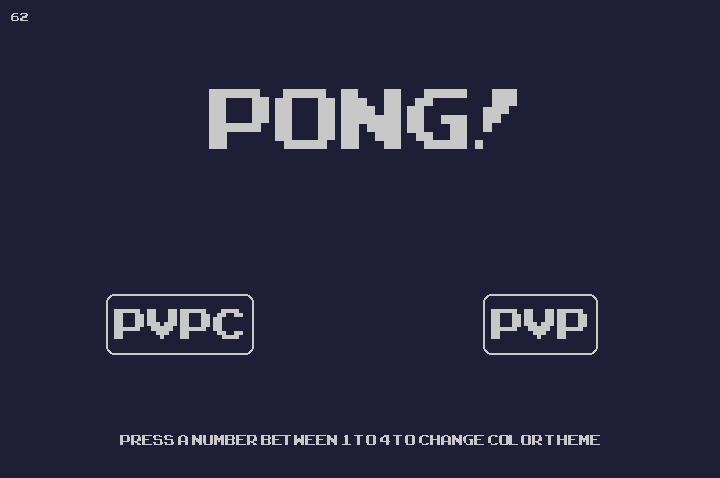
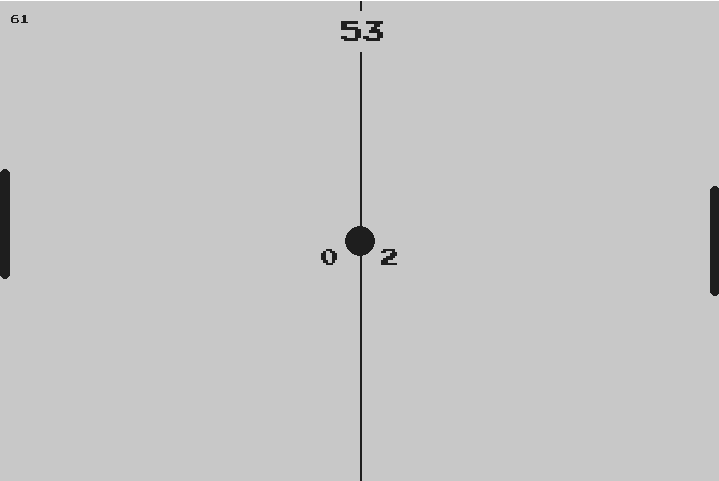

# Pong!

Pong game clone made entirely in python with pygame.

## Feature

* The game can be played mutiplayer and single-player.

* Color theme can be change with the keyboard number between 1-4.

    ### Colors:
    1) Default (Blue and White)
    2) Dark (Black and White)
    3) Light (White and Black)
    4) Watermelon (Red, Green and Black)
